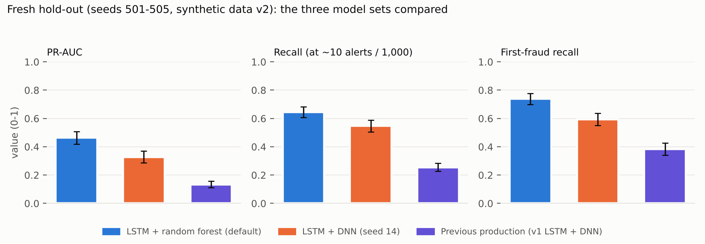

# ML experiment status

Scope: what the repository's machine-learning evidence actually shows after this audit, what was independently re-checked, and what is missing.
**All data are synthetic.** Nothing below describes real-world banking performance.

## 1. Datasets (verified)

| Dataset | What it is | Verified facts |
|---|---|---|
| v1 seed (`data/transactions_with_features.csv`) | 500 synthetic customers; the dashboard's histories and the training data of the `production` model set | 93,913 rows, 819 fraud rows (0.872 %), 60 fraud customers; no NaN/inf; no duplicate ids. **Trivially separable:** `amount_pct_of_avg` alone has ROC-AUC 1.000; the rule "unusual hour AND amount ≥ 188 % of average" gives recall 1.000, precision 0.967 on it. Features were generated by an earlier code version (R-08). Not reproducible from the generator because dates use `datetime.now()` (R-09) |
| v2 (`data/v2`, generator 2.0.1) | deterministic synthetic generator with 7 fraud archetypes, rings, legitimate anomalies (travel, new devices, VPN …) | seed 42 regenerated in this audit (Python 3.13 / pandas 3.0.6) reproduced all five committed SHA-256 hashes. Default: 500 customers, 101,297 transactions, 471 fraud rows (0.465 %), 110 episodes |
| v2 hold-out seeds | fresh datasets generated once for the pre-registered confirmation | 501–505 (5 × 500 customers, 487,368 rows, 2,390 fraud rows, 550 episodes) and 511–515 (new-customer variant, 450,095 rows, 2,693 fraud rows, 632 episodes) |

## 2. Models and training (as implemented)

* **LSTM** (`lstm_model.py`): input 10 × 9, `Masking → LSTM(64) → Dropout → LSTM(32) → Dropout → Dense(16) → Dense(1, sigmoid)`, 31,905 parameters.
  Target: is the **next** transaction after the 10-transaction window fraudulent; output ×100 = Risk Score. Past-only windows; the current transaction is excluded.
* **Random forest** (default): 200 trees, max depth 12, min leaf 5, no class weighting; inputs = 9 features + Risk Score; trained on **out-of-fold** LSTM scores
  (leakage-safe stacking). Selected by pre-registered protocol "4D v1" among DNN, logistic regression, random forest, histogram gradient boosting.
* **DNN** (previous classifier): `64 → BatchNorm → Dropout → 32 → Dropout → 16 → 1`, 3,585 parameters.
* Cold start (< 10 earlier transactions): LSTM skipped, Risk Score = training mean; first transaction: baseline-relative features set to the training mean.
* Serving: scores are model scores 0–100, capped at 99.9; **no calibration** is applied (calibration appears only as an offline evaluation analysis).
* Split design (`evaluation/split.py`): time-based primary split with whole fraud episodes/rings kept together, customer-group secondary split, thresholds chosen on validation only, seeds fixed, TensorFlow determinism enabled.

## 3. Independent verification performed in this audit

| Check | Result |
|---|---|
| Recompute PR-AUC, ROC-AUC and the confusion matrix of the v2 time-split evaluation from the committed per-row scores | **Exact match** (table below) |
| Internal consistency of the hold-out report: recall = TP/(TP+FN), precision = TP/(TP+FP), FPR = FP/(FP+TN) for the default model | consistent (1,542 / 2,390 = 0.645; 1,542 / 6,527 = 0.236; 4,985 / 484,978 = 0.0103) |
| README headline claims (PR-AUC 0.464 vs 0.328; recall 0.645 vs 0.548) | match `final_holdout_report.json`; gate C1 difference 0.136 = 0.464 − 0.328 |
| Protocol discipline | the selection record states the hold-out did not exist when the decision was written; protocol and dataset hashes are recorded |
| Hold-out re-run | **not performed** (single-use by design; per-row scores not committed) |

*Test period: 21,142 windows, 61 fraud rows (from the committed `scores_time_split.csv.gz`).*

| Model | PR-AUC recomputed | PR-AUC in report | ROC-AUC recomputed | ROC-AUC in report |
|---|---|---|---|---|
| lstm_risk_predictor | 0.1345 | 0.1345 | 0.7407 | 0.7407 |
| dnn_fraud_classifier | 0.1045 | 0.1045 | 0.8993 | 0.8993 |
| amount_hour_rule | 0.0272 | 0.0272 | 0.7296 | 0.7296 |
| logistic_regression | 0.1375 | 0.1375 | 0.8905 | 0.8905 |
| dnn_without_risk_score | 0.1283 | 0.1283 | 0.8965 | 0.8965 |

Observation: on this harder v2 time-split test the PR-AUCs are low (0.03–0.14) and the best of them is logistic regression (0.1375), above the DNN
(0.1045) and the LSTM score alone (0.1345); only **61 fraud rows** are in the test period, so these are very uncertain.

## 4. Fresh hold-out results (verbatim from `final_holdout_report.json`)

**Hold-out seeds 501–505**

*5 fresh datasets, 487,368 transactions, 2,390 fraud transactions, 550 fraud episodes, 550 first-fraud transactions.*

| Model | PR-AUC [95% CI] | ROC-AUC | Recall [95% CI] | Precision | F1 | Legit alerts / 1,000 | First-fraud recall [95% CI] | Episodes detected |
|---|---|---|---|---|---|---|---|---|
| LSTM + random forest (default) | 0.464 [0.419, 0.509] | 0.939 | 0.645 [0.608, 0.683] | 0.236 | 0.346 | 10.23 | 0.738 [0.699, 0.776] | 439 / 550 |
| LSTM + DNN (seed 14) | 0.328 [0.286, 0.371] | 0.929 | 0.548 [0.505, 0.588] | 0.217 | 0.311 | 9.68 | 0.595 [0.550, 0.637] | 386 / 550 |
| Previous production (v1 LSTM + DNN) | 0.133 [0.111, 0.157] | 0.691 | 0.255 [0.228, 0.283] | 0.104 | 0.148 | 10.71 | 0.384 [0.340, 0.427] | 322 / 550 |

**New-customer variant, seeds 511–515**

*5 fresh datasets, 450,095 transactions, 2,693 fraud transactions, 632 fraud episodes, 549 first-fraud transactions.*

| Model | PR-AUC [95% CI] | ROC-AUC | Recall [95% CI] | Precision | F1 | Legit alerts / 1,000 | First-fraud recall [95% CI] | Episodes detected |
|---|---|---|---|---|---|---|---|---|
| LSTM + random forest (default) | 0.490 [0.449, 0.531] | 0.939 | 0.638 [0.603, 0.675] | 0.287 | 0.396 | 9.50 | 0.738 [0.696, 0.776] | 492 / 632 |
| LSTM + DNN (seed 14) | 0.365 [0.323, 0.408] | 0.928 | 0.533 [0.495, 0.572] | 0.266 | 0.355 | 8.78 | 0.599 [0.555, 0.642] | 440 / 632 |
| Previous production (v1 LSTM + DNN) | 0.163 [0.138, 0.188] | 0.705 | 0.269 [0.241, 0.297] | 0.133 | 0.178 | 10.49 | 0.399 [0.355, 0.443] | 366 / 632 |

Reading the evidence: on the fresh synthetic hold-outs the LSTM + random forest is clearly better than the DNN variants under the project's own metrics, at about 10
alerts per 1,000 legitimate transactions (the validation-chosen budget). Its precision is about 0.24, meaning roughly three of four alerts are false at that budget.
For the default model, first-fraud recall (0.738) is higher than recall over all fraud transactions (0.645); they use different denominators (550 first transactions vs 2,390 fraud rows), and this audit did not analyse why. The project's earlier finding stands: the LSTM score does not warn *before* a first fraud
(`docs/EVALUATION.md`), and on v2 the DNN-only variant detects first frauds at least as well as the LSTM variant (`docs/step4c3e-stage-c-final-evaluation.md`).

## 5. What the evidence does and does not support

* **Supported:** among the compared designs, LSTM + random forest ranks fraud better on fresh, same-generator synthetic data; metrics are computed with
  validation-chosen thresholds and group-level bootstrap intervals; the pipeline is leakage-controlled by design (past-only features, out-of-fold stacking, whole-episode splits).
* **Not supported:** any statement about real banking data; calibrated probabilities; early warning before a first fraud; the usefulness of the Behavioral Similarity
  Score (no evaluation of it exists; it is a heuristic with equal feature weights, and R-05 shows it misleads for new customers); generalisation to a different
  data generator (training and hold-out share the v2 generator and its assumptions).

## 6. Missing evidence and a plan to obtain it

| Gap | Why it matters | Proposed procedure (nothing below has been run) |
|---|---|---|
| Real or independently generated data | all conclusions share one generator's assumptions | evaluate on an independent generator and, if licensing and access allow, a public fraud dataset after checking schema, labels, time information; report separately from synthetic results. A design for this exists in `experiments/sequence_early_detection/PROTOCOL_DRAFT_v1.md` |
| Calibration | scores are described as uncalibrated, but alert bands imply meaning | fit calibration on validation only (isotonic or Platt), report reliability curves and ECE on the hold-out; then re-derive alert bands (R-02) |
| Small v2 time-split test (61 fraud rows) | wide uncertainty | rely on the 550-episode hold-outs; extend with additional fresh seeds if a claim depends on small differences |
| Behavioral Similarity Score | never evaluated | measure its separation of fraud vs legitimate rows and its agreement with the model score on the hold-out data; compare with a learned weighting |
| First-fraud / early warning | the stated research hypothesis is not supported | see `experiments/sequence_early_detection/` (protocol drafted, not run) |
| Re-run of the hold-out | single-use by design | a new fresh seed set under a new pre-registered protocol, not a re-score of 501–505 |
